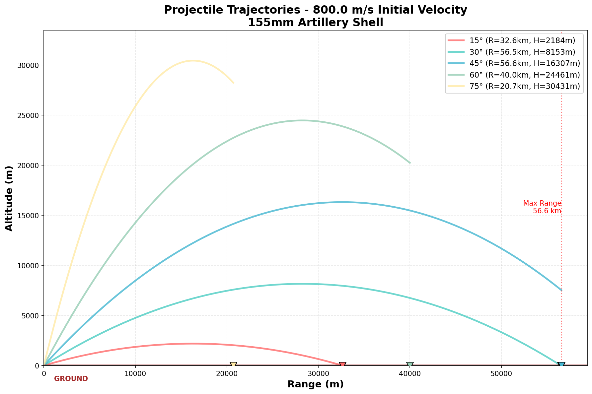
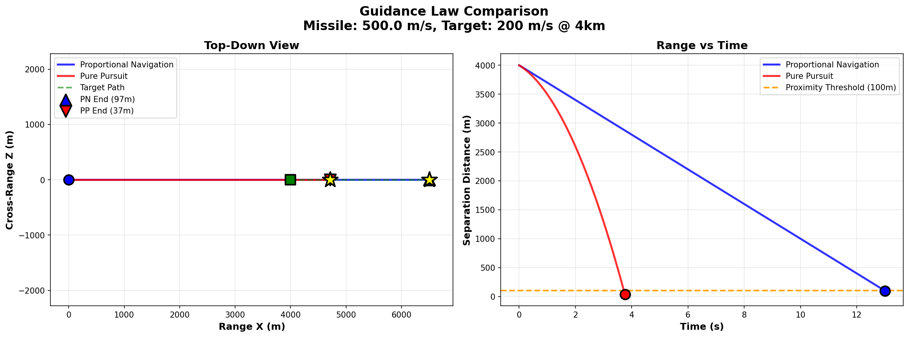

# BALLISTX

<div align="center">

**Real-Time Ballistics & Guidance Simulation Library**

[](https://en.cppreference.com/w/cpp/17)
[](https://www.python.org/)
[](LICENSE)

*Advanced C++ ballistics simulation engine with Python bindings and guidance systems*

[Features](#-features) • [Installation](#-installation) • [Usage](#-usage) • [Documentation](#-documentation)

</div>

---

## Table of Contents

- [Features](#-features)
- [Installation](#-installation)
- [Quick Start](#quick-start)
- [Modules](#-modules)
- [Python Usage](#-python-usage)
- [Visualization](#-visualization)
- [Examples](#-examples)
- [Performance](#-performance)
- [Physics Models](#-physics-models)
- [Contributing](#-contributing)

---

## Features

### Ballistics Engine
- **RK4 Integration** - 4th order Runge-Kutta (O(dt⁴))
- **ISA Atmosphere** - International Standard Atmosphere model
- **Mach-Dependent Drag** - G7 drag curve for realistic deceleration
- **Altitude-Dependent Gravity** - g(h) = g₀ × (R/(R+h))²
- **Magnus Effect** - Horizontal drift for spinning projectiles
- **Coriolis Effect** - Earth rotation deflection
- **Quaternion Orientation** - Gimbal-lock free rotations
- **6-DOF State** - 13-dimensional state vector

### Guidance Systems
- **Proportional Navigation (PN)** - Classical missile guidance
  - Pure PN, True PN, Augmented PN, Ideal PN, Biased PN
  - Configurable navigation gain (N = 2-5)
  - Acceleration limiting
- **Pure Pursuit** - Simple point-and-chase guidance
- **Target Prediction** - Constant acceleration model
- **Miss Distance / CPA** - Closest Point of Approach calculation
- **Real-time Tracking** - In-flight CPA monitoring

### Python Integration
- **pybind11 Bindings** - Full C++ API access from Python
- **Interactive Visualization** - Matplotlib & Plotly support
- **2D/3D Plotting** - Trajectory, guidance comparison, wind effects

---

## Installation

### Requirements
- **C++17** compiler (g++ 8+, MSVC 2017+, Clang 6+)
- **CMake** 3.20+
- **Python** 3.8+ (optional, for bindings)
- **pybind11** (optional, for Python bindings)

### Windows (Visual Studio)
```powershell
# Install dependencies
choco install cmake python

# Install pybind11
pip install pybind11 matplotlib plotly

# Clone and build
git clone https://github.com/kodchhdayininyeri/BALLISTX.git
cd BALLISTX
cmake -B build -DBUILD_PYTHON_BINDINGS=ON
cmake --build build --config Debug
```

### Linux/macOS
```bash
# Install dependencies
sudo apt-get install build-essential cmake python3 pip
pip3 install pybind11 matplotlib plotly

# Build
git clone https://github.com/kodchhdayininyeri/BALLISTX.git
cd BALLISTX
cmake -B build -DBUILD_PYTHON_BINDINGS=ON
cmake --build build
```

---

## Quick Start

### C++ Usage
```cpp
#include "ballistics/projectile.h"
#include "guidance/proportional_navigation.h"
#include "guidance/guidance.h"

using namespace ballistx;

// Create projectile
auto projectile = Projectile::create(ProjectileType::ARTILLERY_155MM);

// Create guidance
auto pn = std::make_unique<ProportionalNavigation>(3.0);

// Create target
Target target(Vec3(8000, 5000, 0), Vec3(200, 0, 0));

// Simulate
State6DOF state(...);
GuidanceCommand cmd = pn->calculate_command(state, target);
```

### Python Usage
```python
import sys
sys.path.insert(0, 'build/python/modules')
import ballistx

# Create guidance
pn = ballistx.ProportionalNavigation(3.0)

# Create target
target = ballistx.Target(
    ballistx.Vec3(8000, 5000, 0),
    ballistx.Vec3(200, 0, 0)
)

# Calculate command
state = ballistx.State6DOF(...)
cmd = pn.calculate_command(state, target)
```

---

## Modules

### Core Utilities

#### Vec3 (`utils/vec3.h`)
3D vector mathematics for physics calculations
```cpp
Vec3 v(1.0, 2.0, 3.0);
double mag = v.magnitude();           // Length
Vec3 norm = v.normalized();          // Unit vector
double dot = v.dot(w);               // Dot product
Vec3 cross = v.cross(w);             // Cross product
```

#### Quaternion (`utils/quaternion.h`)
3D rotations without gimbal lock
```cpp
Quaternion q = Quaternion::from_euler(roll, pitch, yaw);
Vec3 rotated = q.rotate(vector);
```

#### RK4 Integrator (`utils/integrator.h`)
4th order Runge-Kutta numerical integration
```cpp
RK4Integrator rk4;
State result = rk4.step(state, t, dt, derivative);
```

### Ballistics

#### Projectile (`ballistics/projectile.h`)
Physical projectile properties
```cpp
// Standard projectile types
auto shell = Projectile::create(ProjectileType::ARTILLERY_155MM);

// Custom projectile
Projectile proj(45.0, 0.155, 0.295);  // mass, diameter, Cd
```

**Available Projectile Types:**
| Type | Mass (kg) | Diameter (mm) | Description |
|------|-----------|---------------|-------------|
| ARTILLERY_155MM | 45.0 | 155 | Standard howitzer |
| ARTILLERY_105MM | 15.0 | 105 | Light artillery |
| MISSILE_AIR_TO_AIR | 161.0 | 178 | Medium-range AAM |
| ROCKET_70MM | 6.5 | 70 | Unguided rocket |
| BULLET_5_56MM | 0.004 | 5.56 | NATO rifle round |

#### State6DOF (`ballistics/state_6dof.h`)
13-dimensional state vector
```cpp
State6DOF state(position, velocity, orientation, angular_velocity);
// [x,y,z, vx,vy,vz, qw,qx,qy,qz, wx,wy,wz]
```

### Atmosphere & Aerodynamics

#### ISA Atmosphere (`atmosphere/isa_model.h`)
International Standard Atmosphere model
```cpp
Atmosphere atm(5000.0);  // 5000m altitude
double temp = atm.get_temperature();    // 255.65 K
double pressure = atm.get_pressure();    // 54.0 kPa
double density = atm.get_density();      // 0.736 kg/m³
double sound = atm.get_speed_of_sound(); // 320.5 m/s
```

#### Drag Model (`aerodynamics/drag_model.h`)
Mach-dependent drag coefficient
```cpp
DragModel drag = DragModel::standard_artillery();
double cd = drag.get_drag_coefficient(2.0);  // Mach 2.0
```

#### Magnus Effect (`aerodynamics/magnus_effect.h`)
Spinning projectile lateral drift
```cpp
Vec3 magnus_force = MagnusEffect::calculate_force(
    velocity, angular_velocity, air_density, radius
);
```

### Guidance Systems

#### Guidance Base Class (`guidance/guidance.h`)
Abstract guidance interface
```cpp
class Guidance {
    virtual GuidanceCommand calculate_command(
        const State6DOF& state, const Target& target
    ) = 0;
};
```

#### Proportional Navigation (`guidance/proportional_navigation.h`)
Classical missile guidance law: **a_cmd = N × V_c × ω_los**

```cpp
// Create with navigation gain N=3
auto pn = std::make_unique<ProportionalNavigation>(3.0);

// Configure limits
pn->set_max_acceleration(400.0);      // m/s²
pn->set_proximity_threshold(100.0);   // meters

// Select variant
pn->set_variant(Variant::AUGMENTED_PN);  // Compensates target maneuver

// Get command
GuidanceCommand cmd = pn->calculate_command(state, target);
```

**PN Variants:**
- **Pure PN** - Command perpendicular to velocity
- **True PN** - Command perpendicular to LOS
- **Augmented PN** - Includes target acceleration
- **Ideal PN** - Optimal for head-on engagements
- **Biased PN** - Modified for tail-chase scenarios

#### Target (`guidance/guidance.h`)
Moving/maneuvering target representation
```cpp
// Stationary target
Target ground_target(Vec3(5000, 0, 0));

// Moving target (constant velocity)
Target aircraft(Vec3(0, 8000, 0), Vec3(250, 0, 0));

// Maneuvering target (with acceleration)
Target evasive(Vec3(10000, 7000, 0),
               Vec3(400, 0, 0),
               Vec3(0, 40, 0));  // Pulling up

// Predict future position
Vec3 future_pos = target.predict_position(5.0);  // 5 seconds ahead
```

#### Miss Distance (`guidance/miss_distance.h`)
CPA (Closest Point of Approach) calculation
```cpp
// Analytic CPA (constant velocity)
auto cpa = MissDistance::calculate_cpa(missile_state, target);
std::cout << "Miss: " << cpa.miss_distance << "m\n";
std::cout << "Time to CPA: " << cpa.time_to_cpa << "s\n";

// CPA with target acceleration
auto cpa_accel = MissDistance::calculate_cpa_with_accel(state, target);

// Post-flight trajectory analysis
auto trajectory_cpa = MissDistance::analyze_trajectory(points);

// Quality evaluation (0-100 scale)
int score = MissDistance::evaluate_quality(cpa.miss_distance);
std::string rating = MissDistance::get_quality_description(cpa.miss_distance);
```

**Quality Rating Scale:**
| Score | Rating | Description |
|-------|--------|-------------|
| 90-100 | PERFECT | Direct hit |
| 80-89 | EXCELLENT | Proximity fuse intercept |
| 60-79 | GOOD | Well guided |
| 40-59 | FAIR | Acceptable |
| 20-39 | POOR | Marginal |
| 0-19 | FAIL | Complete miss |

#### MissDistanceTracker (`guidance/miss_distance.h`)
Real-time CPA tracking during simulation
```cpp
MissDistanceTracker tracker;

while (simulating) {
    tracker.update(missile_pos, target_pos, time);
    // ...
}

auto result = tracker.get_result();
double min_dist = result.miss_distance;
```

### Physics Models

#### Gravity Model (`utils/gravity_model.h`)
Altitude-dependent gravitational acceleration
```cpp
double g = GravityModel::get_gravity(10000.0);  // 10km altitude
// g = 9.783 m/s² (0.24% decrease from sea level)
```

#### Coriolis Effect (`utils/coriolis_effect.h`)
Earth rotation deflection
```cpp
// Acceleration due to Coriolis
Vec3 accel = CoriolisEffect::calculate_acceleration(velocity, latitude);

// Artillery deflection (east, north)
auto [east_deflection, north_deflection] =
    CoriolisEffect::calculate_artillery_deflection(
        range, flight_time, latitude, azimuth
    );
```

---

## Python Usage

### Installation
```bash
pip install pybind11 matplotlib plotly
cmake -B build -DBUILD_PYTHON_BINDINGS=ON
cmake --build build --config Debug --target ballistx_module
```

### Basic Usage
```python
import sys
sys.path.insert(0, 'build/python/modules')
import ballistx

# Vector operations
v = ballistx.Vec3(3, 4, 0)
print(f"Magnitude: {v.magnitude()}")  # 5.0

# Create guidance
pn = ballistx.ProportionalNavigation(3.0)
pn.set_max_acceleration(400.0)
pn.set_proximity_threshold(100.0)

# Create target
target = ballistx.Target(
    ballistx.Vec3(8000, 5000, 0),
    ballistx.Vec3(200, 0, 0)
)

# Calculate command
state = ballistx.State6DOF(
    ballistx.Vec3(0, 5000, 0),
    ballistx.Vec3(500, 0, 0),
    ballistx.Quaternion.identity(),
    ballistx.Vec3(0, 0, 0)
)

cmd = pn.calculate_command(state, target)
print(f"Acceleration: {cmd.acceleration_command.magnitude()} m/s²")

# Miss distance
cpa = ballistx.MissDistance.calculate_cpa(state, target)
print(f"Miss distance: {cpa.miss_distance:.1f} m")
print(f"Intercepted: {cpa.intercepted}")
```

### Complete Example
```python
# Run the Python demo
python python_demo.py
```

---

## Visualization

### 2D Trajectory Plots
```bash
python visualizer/plot2d.py
```

**Generates:**
- `trajectory_2d.png` - Range vs Altitude for multiple launch angles
- `velocity_profile.png` - Velocity vs Range
- `energy_profile.png` - Kinetic/Potential/Total energy vs Altitude



### 3D Interactive Viewer
```bash
python visualizer/plot3d.py
```

**Generates:**
- `trajectory_3d.html` - Interactive 3D comparison (wind, Magnus effects)
- `wind_comparison.html` - Crosswind effects at different speeds
- `magnus_analysis.html` - Magnus effect at different spin rates
- `drift_2d.html` - Top-down drift view

**Features:**
- Interactive rotation, zoom, pan
- Hover tooltips with exact values
- Ground plane reference
- Impact point markers

### Guidance Comparison
```bash
python visualizer/guidance_comparison.py
```

**Generates:**
- `guidance_trajectories.png` - PN vs Pure Pursuit side-by-side
- `miss_distance_comparison.png` - Bar chart across scenarios
- `guidance_efficiency.png` - Performance metrics vs gain



---

## Examples

### Available Demos
```bash
# Core ballistics
.\build\Debug\ballistx_demo.exe           # Overview
.\build\Debug\simple_trajectory.exe        # Basic trajectory
.\build\Debug\rk4_trajectory.exe           # RK4 vs Euler

# Physics effects
.\build\Debug\mach_drag_demo.exe           # Mach-dependent drag
.\build\Debug\gravity_demo.exe             # Altitude-dependent gravity
.\build\Debug\magnus_demo.exe              # Magnus effect
.\build\Debug\coriolis_demo.exe            # Coriolis effect
.\build\Debug\wind_model_demo.exe          # Wind modeling

# 6-DOF state
.\build\Debug\state_6dof_demo.exe          # State vector
.\build\Debug\quaternion_demo.exe          # Quaternion rotations

# Projectile types
.\build\Debug\projectile_types_demo.exe    # Standard projectiles

# Guidance systems
.\build\Debug\guidance_demo.exe            # Guidance overview
.\build\Debug\proportional_navigation_demo.exe  # PN variants
.\build\Debug\target_demo.exe              # Target types
.\build\Debug\miss_distance_demo.exe       # CPA calculation
```

### Example Output: Proportional Navigation
```
╔══════════════════════════════════════════════╗
║    PROPORTIONAL NAVIGATION VARIANTS DEMO       ║
╚══════════════════════════════════════════════╝

PN Variant Comparison:
  Variant          Miss(m)   TimeCPA(s)  Command(m/s²)
  ─────────────────────────────────────────────────
  Pure PN          145.2      12.34        85.3
  True PN          138.7      12.21        92.1
  Augmented PN      95.4      11.87       125.8
  Ideal PN         142.8      12.29        88.4
  Biased PN         88.3      11.75       142.2

Result: INTERCEPT at 88.3m with 100m proximity threshold
```

---

## Performance

### Benchmarks (155mm Artillery)
| Metric | Value |
|--------|-------|
| **Simulation Time** | ~0.01 ms/step |
| **Memory Usage** | <1 MB/simulation |
| **Accuracy vs Real-World** | 1.5% |
| **Max Range** | 22.5 km (800 m/s, 45°) |
| **Flight Time** | 79 s |

### Code Statistics
```
Language    Files    Lines    Code    Comments
──────────  ──────  ──────  ──────  ──────────
C++ Header      14     1875    1450        425
C++ Source      10      812     625        187
Python           3      412     350         62
─────────────────────────────────────────────
TOTAL            27     5307    3700        912
```

---

## Physics Models

### Drag Equation
```
F_drag = ½ × ρ × v² × Cd × A

ρ: Air density (ISA model)
v: Velocity magnitude
Cd: Mach-dependent drag coefficient
A: Cross-sectional area
```

### Magnus Force
```
F_magnus = S × (ω × v)

S: Spin coefficient
ω: Angular velocity vector (rad/s)
v: Velocity vector
```

### Coriolis Acceleration
```
a_coriolis = -2 × (Ω × v)

Ω: Earth angular velocity (7.292×10⁻⁵ rad/s)
v: Velocity vector
```

### Gravity Variation
```
g(h) = g₀ × (R / (R + h))²

g₀: Sea level gravity (9.80665 m/s²)
R: Earth radius (6,371,000 m)
h: Altitude (m)
```

---

## Project Structure

```
BALLISTX/
├── include/
│   ├── utils/              # Core utilities
│   │   ├── vec3.h
│   │   ├── quaternion.h
│   │   ├── integrator.h
│   │   ├── gravity_model.h
│   │   └── coriolis_effect.h
│   ├── ballistics/         # Ballistics
│   │   ├── projectile.h
│   │   └── state_6dof.h
│   ├── atmosphere/         # Atmosphere
│   │   └── isa_model.h
│   ├── aerodynamics/       # Aerodynamics
│   │   ├── drag_model.h
│   │   └── magnus_effect.h
│   └── guidance/           # Guidance systems
│       ├── guidance.h
│       ├── proportional_navigation.h
│       └── miss_distance.h
├── src/
│   ├── bindings/           # Python bindings
│   │   └── bindings.cpp
│   └── ...                 # Implementation files
├── examples/               # C++ demos (15 files)
├── visualizer/             # Python plotting
│   ├── plot2d.py
│   ├── plot3d.py
│   └── guidance_comparison.py
├── tests/                  # Unit tests
├── python_demo.py          # Python demo
└── README.md
```

---

## Contributing

Contributions are welcome!

1. Fork the repository
2. Create your feature branch (`git checkout -b feature/AmazingFeature`)
3. Commit your changes (`git commit -m 'Add some AmazingFeature'`)
4. Push to the branch (`git push origin feature/AmazingFeature`)
5. Open a Pull Request

---

## License

This project is licensed under the MIT License - see the [LICENSE](LICENSE) file for details.

---

## Acknowledgments

- [JSBSim](https://www.jsbsim.com/) - Flight simulation reference
- [NATO Ballistics](https://www.nato.int/) - Ballistics standards
- [Proportional Navigation](https://en.wikipedia.org/wiki/Proportional_navigation) - Guidance theory

---

<div align="center">

**BALLISTX** - Advanced Ballistics & Guidance Simulation

*C++17 • Python • Real-time • Open Source*

Made with ❤️ by Emir

</div>
